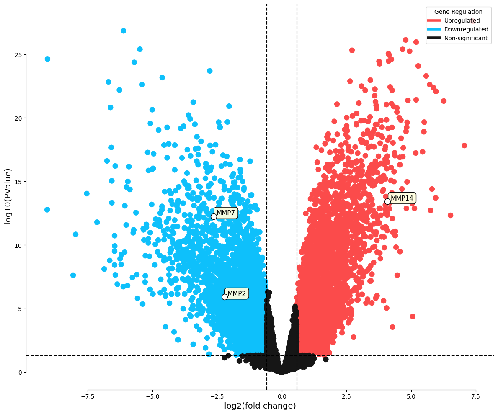

[](https://colab.research.google.com/drive/12v1M7eNUXDem2RFR0TIsBe-NBgKjlny4?usp=sharing)
[](https://doi.org/10.5281/zenodo.13923663)

# Volcano Plot for Gene Expression Analysis

This repository contains a Jupyeter Notebook that generates a **Volcano Plot** for visualizing differential gene expression data, typically from RNA-Seq or microarray experiments.

## Usage

1. **Upload your GEO `.tsv` file**: Provide your data file to the notebook. The file should contain gene names, logFC, and p-values for each gene.
   
2. **Adjust parameters**: Customize the p-value threshold, log fold change threshold, plot dimensions, and colors using the interactive input form in the notebook.

3. **View Results**: The notebook will print a list of upregulated, downregulated, and non-significant genes of interest.
   
4. **Generate Volcano Plot**: The notebook will plot the volcano plot and automatically label genes of interest.

## Citation
```
Shakiba, M. (2024). moneuron/Volcano-Plot: Volcano-Plot. Zenodo. https://doi.org/10.5281/zenodo.13923663
```

## Example output

